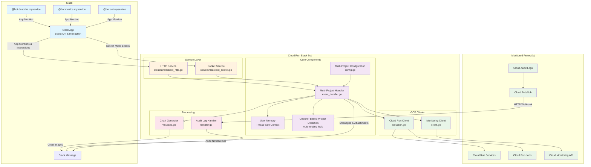

# Cloud Run Slack Bot

This is a simple Slack bot running on Cloud Run with which you can interact with Cloud Run services and jobs.


## Architecture



### Component Descriptions

- **Service Layer**: Handles HTTP webhooks and Socket Mode connections from Slack
- **Multi-Project Handler**: Processes commands and manages user context across multiple GCP projects
- **Configuration**: Manages multi-project settings and channel routing with automatic backward compatibility
- **User Memory**: Thread-safe storage for user context and selected resources
- **Channel-Based Project Detection**: Automatically detects target projects based on Slack channel configuration
- **GCP Clients**: Abstraction layer for Cloud Run and Monitoring APIs with per-project client management
- **Chart Generator**: Creates PNG visualizations for metrics data
- **Audit Log Handler**: Processes real-time Cloud Run audit logs from Pub/Sub with project-specific routing

### Backward Compatibility

The bot maintains full backward compatibility with existing single-project deployments:

- **Legacy Environment Variables**: Original `PROJECT`, `REGION`, and `SERVICE_CHANNEL_MAPPING` variables continue to work
- **Existing Configurations**: No changes required for current deployments
- **Seamless Migration**: Gradual migration path from single-project to multi-project setup
- **Feature Parity**: All existing functionality remains unchanged

For migration guidance, see the [Multi-Project Setup Guide](docs/multi-project-setup.md).

## Features

1. **Multi-Project Support**: Monitor Cloud Run services and jobs across multiple GCP projects with intelligent channel-based project detection
2. **Interactive Slack Commands**: Interact with Cloud Run resources directly through Slack
    - Get metrics of Cloud Run services
    - Describe Cloud Run services and jobs
    - Set target resources for quick access
    - Auto-complete and selection for resources
3. **Real-time Notifications**: Receive notifications for Cloud Run audit logs with project-specific routing
4. **Metrics Visualization**: Generate PNG charts for Cloud Run service metrics
5. **Channel-based Project Detection**: Automatically detect target projects based on Slack channel configuration
6. **Backward Compatibility**: Full support for existing single-project deployments
7. **AI-Powered Error Analysis (Debug Feature)**: Analyze Cloud Run error logs using Gemini AI to group similar errors, identify root causes, and get actionable suggestions

## Cloud Run

### Roles

1. `roles/run.viewer`: To get information of Cloud Run services
1. `roles/monitoring.viewer`: To get metrics of Cloud Run services
1. `roles/logging.viewer`: To read Cloud Logging entries (required for debug feature)
1. `roles/aiplatform.user`: To access Vertex AI Gemini API (required for debug feature)

### Environment Variables

#### Multi-Project Configuration (Recommended)

1. `PROJECTS_CONFIG`: JSON array of project configurations (see [Multi-Project Setup Guide](docs/multi-project-setup.md))
   ```json
   [
     {
       "id": "project1",
       "region": "us-central1",
       "defaultChannel": "project1-alerts",
       "serviceChannels": {
         "web-service": "web-team",
         "api-service": "api-team"
       }
     },
     {
       "id": "project2",
       "region": "us-east1",
       "defaultChannel": "project2-alerts"
     }
   ]
   ```

#### Single-Project Configuration (Legacy - Still Supported)

1. `PROJECT`: GCP Project ID to monitor
1. `REGION`: GCP Region to monitor
1. `SERVICE_CHANNEL_MAPPING`: Mapping of service names to Slack channel IDs (format: `service1:channel1,service2:channel2`)

#### Common Configuration

1. `SLACK_BOT_TOKEN`: Slack Bot Token
1. `SLACK_SIGNING_SECRET`: Slack bot signing secret
1. `SLACK_APP_TOKEN` (optional): Slack oauth token (required for `SLACK_APP_MODE=socket`)
1. `SLACK_APP_MODE`: Slack App Mode (`http` or `socket`)
1. `SLACK_CHANNEL`: Default Slack Channel ID to receive notifications (used as fallback for all configurations)
1. `TMP_DIR` (optional): Temporary directory for storing images (default: `/tmp`)

#### Debug Feature Configuration (Optional)

The debug feature uses Gemini AI via Vertex AI to analyze error logs. To enable:

| Variable | Required | Default | Description |
|----------|----------|---------|-------------|
| `DEBUG_ENABLED` | No | `false` | Set to `true` to enable the debug feature |
| `GCP_PROJECT_ID` | When enabled | - | GCP project ID for Vertex AI API access |
| `VERTEX_LOCATION` | When enabled | - | GCP region for Vertex AI (e.g., `us-central1`) |
| `MODEL_NAME` | No | `gemini-2.5-flash-lite` | Gemini model to use for analysis |
| `DEBUG_TIME_WINDOW` | No | `30` | Time window for error analysis (in minutes) |

**Usage**: `@bot debug` or `@bot dbg` to analyze recent errors for a Cloud Run service or job.

**Required IAM Permissions** (on the Vertex AI project):
- `aiplatform.endpoints.predict` - Access Vertex AI Gemini API

**Required APIs** (must be enabled on the Vertex AI project):
- Vertex AI API (`aiplatform.googleapis.com`)

> **Note**: When using `PROJECTS_CONFIG`, the bot automatically generates channel-to-project mappings for intelligent project detection. For detailed configuration options, see the [Multi-Project Setup Guide](docs/multi-project-setup.md).

### Deploy

```
PROJECT=your-project
REGION=asia-northeast1
```

### Initial Setup

```shell
echo -n "xoxb-xxxx" | gcloud secrets create slack-bot-token --replication-policy automatic --project "$PROJECT" --data-file=-
echo -n "your-signing-secret" | gcloud secrets create slack-signing-secret --replication-policy automatic --project "$PROJECT" --data-file=-
gcloud iam service-accounts create cloud-run-slack-bot --project $PROJECT
# allow app to access the secret
gcloud secrets add-iam-policy-binding slack-bot-token \
    --member="serviceAccount:cloud-run-slack-bot@${PROJECT}.iam.gserviceaccount.com" \
    --role="roles/secretmanager.secretAccessor" --project ${PROJECT}
gcloud secrets add-iam-policy-binding slack-signing-secret \
    --member="serviceAccount:cloud-run-slack-bot@${PROJECT}.iam.gserviceaccount.com" \
    --role="roles/secretmanager.secretAccessor" --project ${PROJECT}
# allow app to get information about Cloud Run services
gcloud projects add-iam-policy-binding $PROJECT \
    --member=serviceAccount:cloud-run-slack-bot@${PROJECT}.iam.gserviceaccount.com --role=roles/run.viewer
# allow app to get metrics of Cloud Run services
gcloud projects add-iam-policy-binding $PROJECT \
    --member=serviceAccount:cloud-run-slack-bot@${PROJECT}.iam.gserviceaccount.com --role=roles/monitoring.viewer
```

Deploy to Cloud Run

#### Multi-Project Deployment (Recommended)

```bash
# Create PROJECTS_CONFIG environment variable
PROJECTS_CONFIG='[
  {
    "id": "project1",
    "region": "us-central1",
    "defaultChannel": "project1-alerts",
    "serviceChannels": {
      "web-service": "web-team",
      "api-service": "api-team"
    }
  },
  {
    "id": "project2",
    "region": "us-east1",
    "defaultChannel": "project2-alerts",
    "serviceChannels": {
      "batch-job": "batch-team"
    }
  }
]'

# Deploy with multi-project configuration
gcloud run deploy cloud-run-slack-bot \
    --set-secrets "SLACK_BOT_TOKEN=slack-bot-token:latest,SLACK_SIGNING_SECRET=slack-signing-secret:latest" \
    --set-env-vars "PROJECTS_CONFIG=$PROJECTS_CONFIG,SLACK_APP_MODE=http,TMP_DIR=/tmp,SLACK_CHANNEL=general" \
    --image nakamasato/cloud-run-slack-bot:0.5.1 \
    --service-account cloud-run-slack-bot@${PROJECT}.iam.gserviceaccount.com \
    --project "$PROJECT" --region "$REGION"
```

#### Single-Project Deployment (Legacy)

```bash
# Traditional single-project deployment
gcloud run deploy cloud-run-slack-bot \
    --set-secrets "SLACK_BOT_TOKEN=slack-bot-token:latest,SLACK_SIGNING_SECRET=slack-signing-secret:latest" \
    --set-env-vars "PROJECT=$PROJECT,REGION=$REGION,SLACK_APP_MODE=http,TMP_DIR=/tmp,SLACK_CHANNEL=general,SERVICE_CHANNEL_MAPPING=service1:channel1,service2:channel2" \
    --image nakamasato/cloud-run-slack-bot:0.5.1 \
    --service-account cloud-run-slack-bot@${PROJECT}.iam.gserviceaccount.com \
    --project "$PROJECT" --region "$REGION"
```

> **Note**: For comprehensive multi-project setup including IAM permissions and Pub/Sub configuration, see the [Multi-Project Setup Guide](docs/multi-project-setup.md).

## Slack App

1. Create a new Slack App
    - [https://api.slack.com/apps](https://api.slack.com/apps)
1. Add the following scopes:
    - [app_mentions:read](https://api.slack.com/scopes/app_mentions:read)
    - [chat:write](https://api.slack.com/scopes/chat:write)
    - [files:write](https://api.slack.com/scopes/files:write)
    - [connections:write](https://api.slack.com/scopes/connections:write) (required only when using Socket Mode with `SLACK_APP_MODE=socket`)
1. Install the app to your workspace
1. Event Subscriptions
    - Request URL: `https://your-cloud-run-url/slack/events`
    - Subscribe to bot events: `app_mention`
1. Interactivity & Shortcuts
    - Request URL: `https://your-cloud-run-url/slack/interaction`

## Slack Channel Settings

1. Remove preview for console.cloud.google.com


## More

1. [Multi-Project Setup Guide](docs/multi-project-setup.md)
1. [Auditing Notification](docs/auditing.md)
