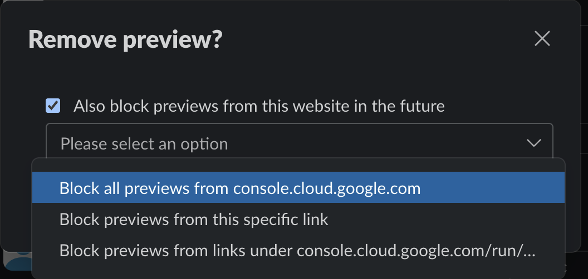

# Cloud Run Slack Bot

This is a simple Slack bot running on Cloud Run with which you can interact with Cloud Run services.


## Features

Interact with Cloud Run service on Slack.
1. Get metrics of Cloud Run service.
1. Describe Cloud Run service.

## Cloud Run

### Roles

1. `roles/monitoring.viewer`: To get metrics of Cloud Run services

### Environment Variables

1. `PROJECT`: GCP Project ID to monitor
1. `REGION`: GCP Region to monitor
1. `SLACK_BOT_TOKEN`: Slack Bot Token
1. `SLACK_OAUTH_TOKEN`: Slack oauth token
1. `SLACK_APP_MODE`: Slack App Mode (`events` or `socket`)
1. `TMP_DIR` (optional): Temporary directory for storing images (default: `/tmp`)

## Slack App

Necessary scopes:
- [mention:read](https://api.slack.com/scopes/app_mentions:read)
- [chat:write](https://api.slack.com/scopes/chat:write)
- [files:write](https://api.slack.com/scopes/files:write)

## Local Run

```
go run main.go
```

TODO:
```
curl -H 'Content-Type: application/json' -X POST -d '{"type": "event_callback", "event": {"type": "app_mention", "user": "xx", "reaction": "memo", "item_user": "xx", "item": {"type": "message", "channel": "CHANNEL", "ts": "1701919197.246629"}, "event_ts": "1704502151.000000"}}' localhost:8080/slack/events
```

## Deploy

```
PROJECT=your-project
REGION=asia-northeast1
```

### Initial Setup

```shell
echo -n "xoxb-xxxx" | gcloud secrets create slack-bot-token --replication-policy automatic --project "$PROJECT" --data-file=-
gcloud iam service-accounts create cloud-run-slack-bot --project $PROJECT
# allow app to access the secret
gcloud secrets add-iam-policy-binding slack-bot-token \
    --member="serviceAccount:cloud-run-slack-bot@${PROJECT}.iam.gserviceaccount.com" \
    --role="roles/secretmanager.secretAccessor" --project ${PROJECT}
# allow app to get information about Cloud Run services
gcloud projects add-iam-policy-binding $PROJECT \
    --member=serviceAccount:cloud-run-slack-bot@${PROJECT}.iam.gserviceaccount.com --role=roles/run.viewer
# allow app to get metrics of Cloud Run services
gcloud projects add-iam-policy-binding $PROJECT \
    --member=serviceAccount:cloud-run-slack-bot@${PROJECT}.iam.gserviceaccount.com --role=roles/monitoring.viewer
```

Build a container image

```
gcloud builds submit . --pack "image=$REGION-docker.pkg.dev/$PROJECT/cloud-run-source-deploy/cloud-run-slack-bot" --project ${PROJECT}
```

Deploy the image to Cloud Run

```
gcloud run deploy cloud-run-slack-bot \
    --set-secrets SLACK_BOT_TOKEN=slack-bot-token:latest \
    --set-env-vars "PROJECT=$PROJECT,REGION=$REGION,SLACK_APP_MODE=events" \
    --image $REGION-docker.pkg.dev/$PROJECT/cloud-run-source-deploy/cloud-run-slack-bot \
    --service-account cloud-run-slack-bot@${PROJECT}.iam.gserviceaccount.com \
    --project "$PROJECT" --region "$REGION"
```

### Deploy new version

Build a container image

```
gcloud builds submit . --pack "image=$REGION-docker.pkg.dev/$PROJECT/cloud-run-source-deploy/cloud-run-slack-bot" --project ${PROJECT}
```

Deploy the image to Cloud Run

```
gcloud run deploy cloud-run-slack-bot --image $REGION-docker.pkg.dev/$PROJECT/cloud-run-source-deploy/cloud-run-slack-bot --project "$PROJECT" --region "$REGION"
```

### Slack Channel Settings

1. Remove preview for console.cloud.google.com



## References

1. Qiita
    1. [Go で Slack Bot を作る (2020年3月版)](https://qiita.com/frozenbonito/items/cf75dadce12ef9a048e9)
    1. [Go で Interactive な Slack Bot を作る (2020年5月版)](https://qiita.com/frozenbonito/items/1df9bb685e6173160991)
    1. [GolangからSlackに画像を投稿する](https://qiita.com/RuyPKG/items/5ac07ddc04432ee7641b)
    1. [GoでインタラクティブなSlack Botを作る2通りのサンプル（Events API + Interactive Component / Socket Mode）](https://qiita.com/daitai-daidai/items/71f97d9cdb0e2ddf9781)
1. [Querying metrics from Google Cloud Monitoring in Golang](https://medium.com/google-cloud/querying-metrics-from-google-cloud-monitoring-in-golang-2631ee3d33c1)

1. Go packages:
    1. https://pkg.go.dev/cloud.google.com/go/monitoring/apiv3/v2/monitoringpb#ListTimeSeriesRequest
    1. https://pkg.go.dev/github.com/slack-go/slack/socketmode#Client
    1. https://pkg.go.dev/google.golang.org/api/run/v2
    1. https://github.com/llgcode/draw2d/tree/master

