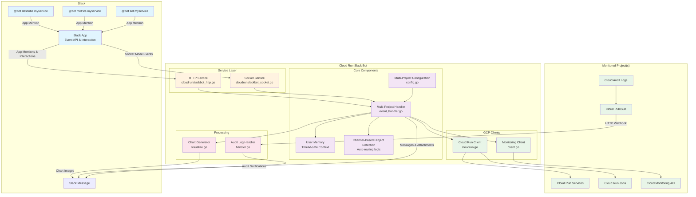

# Cloud Run Slack Bot

A Slack bot for interacting with Google Cloud Run services and jobs directly from Slack. Monitor multiple GCP projects, get metrics, analyze errors with AI, and receive real-time audit log notifications.


## Features

- **Multi-Project Support**: Monitor Cloud Run services and jobs across multiple GCP projects
- **Interactive Commands**: Describe services, view metrics, and manage resources through Slack
- **Intelligent Routing**: Automatically detect target projects based on Slack channel configuration
- **Real-time Notifications**: Receive Cloud Run audit log notifications in designated Slack channels
- **Metrics Visualization**: Generate PNG charts for service metrics
- **AI-Powered Debugging**: Analyze error logs using Gemini AI to identify root causes and get actionable suggestions

## Available Commands

Mention the bot in any configured Slack channel to use these commands:

| Command | Alias | Description |
|---------|-------|-------------|
| `@bot describe` | `@bot d` | Show details about a Cloud Run service or job (revision, last modifier, update time, etc.) |
| `@bot metrics` | `@bot m` | Display request count metrics for a service (with per-revision breakdown) |
| `@bot set` | `@bot s` | Set the target Cloud Run service or job (shows a list to select from) |
| `@bot debug` | `@bot dbg` | Analyze recent error logs using AI (requires DEBUG_ENABLED=true) |
| `@bot help` | `@bot h` | Show available commands |

### Usage Examples

```
@cloud-run-bot describe
@cloud-run-bot metrics
@cloud-run-bot set my-service
@cloud-run-bot debug
```

## Architecture



### Component Descriptions

- **Service Layer**: Handles HTTP webhooks and Socket Mode connections from Slack
- **Multi-Project Handler**: Processes commands and manages user context across multiple GCP projects
- **Configuration**: Manages multi-project settings and channel routing
- **User Memory**: Thread-safe storage for user context and selected resources
- **Channel-Based Project Detection**: Automatically detects target projects based on Slack channel configuration
- **GCP Clients**: Abstraction layer for Cloud Run and Monitoring APIs with per-project client management
- **Chart Generator**: Creates PNG visualizations for metrics data
- **Audit Log Handler**: Processes real-time Cloud Run audit logs from Pub/Sub with project-specific routing

## Quick Start

For detailed setup instructions, see the [Setup Guide](docs/setup.md).

### Prerequisites

- GCP Project(s) with Cloud Run services/jobs
- Slack Workspace with admin access
- Docker or access to the pre-built image: `nakamasato/cloud-run-slack-bot:0.5.1`

### Basic Setup Steps

1. **Create Slack App** with required OAuth scopes (`app_mentions:read`, `chat:write`, `files:write`)
2. **Deploy to Cloud Run** with environment variables configured
3. **Configure Event Subscriptions** in Slack to point to your Cloud Run URL
4. **Invite the bot** to your Slack channels

See the complete [Setup Guide](docs/setup.md) for detailed instructions.

## Configuration

The bot is configured using the `PROJECTS_CONFIG` environment variable:

```json
[
  {
    "id": "project1",
    "region": "us-central1",
    "defaultChannel": "project1-alerts",
    "serviceChannels": {
      "web-service": "web-team",
      "api-service": "api-team"
    }
  },
  {
    "id": "project2",
    "region": "us-east1",
    "defaultChannel": "project2-alerts"
  }
]
```

### Key Configuration Options

- **id**: GCP Project ID to monitor
- **region**: GCP Region to monitor
- **defaultChannel**: Default Slack channel for this project's notifications
- **serviceChannels**: Map specific services/jobs to dedicated Slack channels

For more details, see:
- [Setup Guide](docs/setup.md)
- [Multi-Project Setup Guide](docs/multi-project-setup.md)
- [Terraform Deployment](docs/terraform.md)

## Documentation

- [Setup Guide](docs/setup.md) - Complete setup instructions
- [Multi-Project Setup](docs/multi-project-setup.md) - Configure multiple GCP projects
- [Terraform Deployment](docs/terraform.md) - Infrastructure as Code setup
- [Auditing Notifications](docs/auditing.md) - Cloud Run audit log integration
- [Getting Started](docs/getting-started.md) - Quick start tutorial
- [Development Guide](docs/development.md) - Local development setup

## License

See [LICENSE](LICENSE) file for details.
