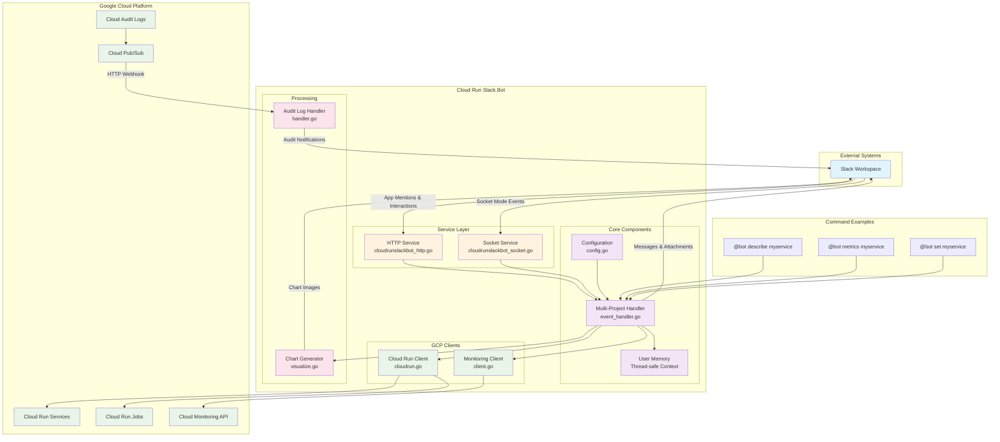

# Cloud Run Slack Bot

This is a simple Slack bot running on Cloud Run with which you can interact with Cloud Run services and jobs.


## Architecture



### Component Descriptions

- **Service Layer**: Handles HTTP webhooks and Socket Mode connections from Slack
- **Multi-Project Handler**: Processes commands and manages user context across multiple GCP projects
- **Configuration**: Manages multi-project settings and channel routing
- **User Memory**: Thread-safe storage for user context and selected resources
- **GCP Clients**: Abstraction layer for Cloud Run and Monitoring APIs
- **Chart Generator**: Creates PNG visualizations for metrics data
- **Audit Log Handler**: Processes real-time Cloud Run audit logs from Pub/Sub

## Features

1. Interact with Cloud Run resources on Slack.
    1. Get metrics of Cloud Run service.
    1. Describe Cloud Run service.
    1. Describe Cloud Run job.
1. Receive notification for Cloud Run audit logs on Slack.

## Cloud Run

### Roles

1. `roles/run.viewer`: To get information of Cloud Run services
1. `roles/monitoring.viewer`: To get metrics of Cloud Run services

### Environment Variables

1. `PROJECT`: GCP Project ID to monitor
1. `REGION`: GCP Region to monitor
1. `SLACK_BOT_TOKEN`: Slack Bot Token
1. `SLACK_SIGNING_SECRET`: Slack bot signing secret
1. `SLACK_APP_TOKEN` (optional): Slack oauth token (required for `SLACK_APP_MODE=socket`)
1. `SLACK_APP_MODE`: Slack App Mode (`http` or `socket`)
1. `SERVICE_CHANNEL_MAPPING`: Mapping of service names to Slack channel IDs (format: `service1:channel1,service2:channel2`)
1. `SLACK_CHANNEL`: Default Slack Channel ID to receive notification for Cloud Run audit logs (used when service is not specified in `SERVICE_CHANNEL_MAPPING`)
1. `TMP_DIR` (optional): Temporary directory for storing images (default: `/tmp`)

### Deploy

```
PROJECT=your-project
REGION=asia-northeast1
```

### Initial Setup

```shell
echo -n "xoxb-xxxx" | gcloud secrets create slack-bot-token --replication-policy automatic --project "$PROJECT" --data-file=-
echo -n "your-signing-secret" | gcloud secrets create slack-signing-secret --replication-policy automatic --project "$PROJECT" --data-file=-
gcloud iam service-accounts create cloud-run-slack-bot --project $PROJECT
# allow app to access the secret
gcloud secrets add-iam-policy-binding slack-bot-token \
    --member="serviceAccount:cloud-run-slack-bot@${PROJECT}.iam.gserviceaccount.com" \
    --role="roles/secretmanager.secretAccessor" --project ${PROJECT}
gcloud secrets add-iam-policy-binding slack-signing-secret \
    --member="serviceAccount:cloud-run-slack-bot@${PROJECT}.iam.gserviceaccount.com" \
    --role="roles/secretmanager.secretAccessor" --project ${PROJECT}
# allow app to get information about Cloud Run services
gcloud projects add-iam-policy-binding $PROJECT \
    --member=serviceAccount:cloud-run-slack-bot@${PROJECT}.iam.gserviceaccount.com --role=roles/run.viewer
# allow app to get metrics of Cloud Run services
gcloud projects add-iam-policy-binding $PROJECT \
    --member=serviceAccount:cloud-run-slack-bot@${PROJECT}.iam.gserviceaccount.com --role=roles/monitoring.viewer
```

Deploy to Cloud Run

```
gcloud run deploy cloud-run-slack-bot \
    --set-secrets "SLACK_BOT_TOKEN=slack-bot-token:latest,SLACK_SIGNING_SECRET=slack-signing-secret:latest" \
    --set-env-vars "PROJECT=$PROJECT,REGION=$REGION,SLACK_APP_MODE=http,TMP_DIR=/tmp,SLACK_CHANNEL=general,SERVICE_CHANNEL_MAPPING=service1:channel1,service2:channel2" \
    --image nakamasato/cloud-run-slack-bot:0.5.1 \
    --service-account cloud-run-slack-bot@${PROJECT}.iam.gserviceaccount.com \
    --project "$PROJECT" --region "$REGION"
```

## Slack App

1. Create a new Slack App
    - [https://api.slack.com/apps](https://api.slack.com/apps)
1. Add the following scopes:
    - [app_mentions:read](https://api.slack.com/scopes/app_mentions:read)
    - [chat:write](https://api.slack.com/scopes/chat:write)
    - [files:write](https://api.slack.com/scopes/files:write)
    - [connections:write](https://api.slack.com/scopes/connections:write) (required only when using Socket Mode with `SLACK_APP_MODE=socket`)
1. Install the app to your workspace
1. Event Subscriptions
    - Request URL: `https://your-cloud-run-url/slack/events`
    - Subscribe to bot events: `app_mention`
1. Interactivity & Shortcuts
    - Request URL: `https://your-cloud-run-url/slack/interaction`

## Slack Channel Settings

1. Remove preview for console.cloud.google.com


## More

1. [Terraform](docs/terraform.md)
1. [Auditing Notification](docs/auditing.md)
