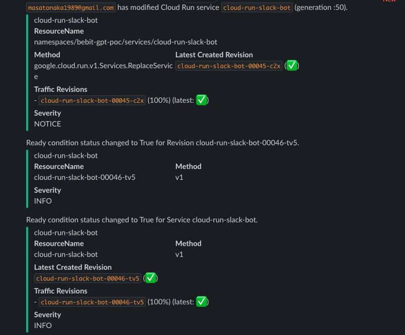

# Cloud Run Audit Logs

## Overview

`cloud-run-slack-bot` also supports to send audit logs to Slack.



Supported logs: `Admin Activity logs` (enabled by default)

1. `Services.CreateService`
1. `Services.ReplaceService`
1. `Services.DeleteService`
1. `Revisions.DeleteRevision`
1. `Jobs.CreateJob`
1. `Jobs.ReplaceJob`
1. `Jobs.DeleteJob`
1. `Executions.DeleteExecution`
1. `Services.SetIamPolicy`
1. `Jobs.SetIamPolicy`

## Setup

[Terraform](terraform.md)


## Cases

### Success

```json
{"insertId":"qd23mgd4u3f","logName":"projects/test-project-1234/logs/cloudaudit.googleapis.com%2Factivity","protoPayload":{"@type":"type.googleapis.com/google.cloud.audit.AuditLog","authenticationInfo":{"principalEmail":"masatonaka1989@gmail.com"},"authorizationInfo":[{"granted":true,"permission":"run.services.update","permissionType":"ADMIN_WRITE","resource":"namespaces/test-project-1234/services/cloud-run-slack-bot","resourceAttributes":{}}],"methodName":"google.cloud.run.v1.Services.ReplaceService","request":{"@type":"type.googleapis.com/google.cloud.run.v1.ReplaceServiceRequest","name":"projects/test-project-1234/locations/asia-northeast1/services/cloud-run-slack-bot","region":"asia-northeast1","service":{"apiVersion":"serving.knative.dev/v1","kind":"Service","metadata":{"annotations":{"run.googleapis.com/client-name":"cloud-console","run.googleapis.com/ingress":"all","run.googleapis.com/ingress-status":"all","run.googleapis.com/launch-stage":"ALPHA","run.googleapis.com/operation-id":"2a91841e-3471-492e-8d35-f4d2f6618f8f","serving.knative.dev/creator":"masatonaka1989@gmail.com","serving.knative.dev/lastModifier":"masatonaka1989@gmail.com"},"creationTimestamp":"2024-04-21T12:33:11.799010Z","generation":22,"labels":{"cloud.googleapis.com/location":"asia-northeast1"},"name":"cloud-run-slack-bot","namespace":"123456789012","resourceVersion":"AAYX0P+214o","selfLink":"/apis/serving.knative.dev/v1/namespaces/123456789012/services/cloud-run-slack-bot","uid":"f6b44b02-8b4a-4f6b-b064-3002f690559e"},"spec":{"template":{"metadata":{"annotations":{"autoscaling.knative.dev/maxScale":"100","autoscaling.knative.dev/minScale":"0","run.googleapis.com/cpu-throttling":"true","run.googleapis.com/sessionAffinity":"false"},"labels":{"run.googleapis.com/startupProbeType":"Default"}},"spec":{"containerConcurrency":80,"serviceAccountName":"cloud-run-slack-bot@test-project-1234.iam.gserviceaccount.com","timeoutSeconds":300}},"traffic":[{"latestRevision":true,"percent":100}]}}},"requestMetadata":{"callerIp":"2400:4050:8e02:1600:4972:ac1a:6f34:a2b2","callerSuppliedUserAgent":"Mozilla/5.0 (Macintosh; Intel Mac OS X 10_15_7) AppleWebKit/537.36 (KHTML, like Gecko) Chrome/124.0.0.0 Safari/537.36,gzip(gfe),gzip(gfe)","destinationAttributes":{},"requestAttributes":{"auth":{},"time":"2024-05-06T22:58:04.672717Z"}},"resourceLocation":{"currentLocations":["asia-northeast1"]},"resourceName":"namespaces/test-project-1234/services/cloud-run-slack-bot","response":{"@type":"type.googleapis.com/google.cloud.run.v1.Service","apiVersion":"serving.knative.dev/v1","kind":"Service","metadata":{"annotations":{"run.googleapis.com/client-name":"cloud-console","run.googleapis.com/ingress":"all","run.googleapis.com/ingress-status":"all","run.googleapis.com/operation-id":"7a9d252c-a432-4fa8-a1ac-1a6fe9e135c0","serving.knative.dev/creator":"masatonaka1989@gmail.com","serving.knative.dev/lastModifier":"masatonaka1989@gmail.com"},"creationTimestamp":"2024-04-21T12:33:11.799010Z","generation":23,"labels":{"cloud.googleapis.com/location":"asia-northeast1"},"name":"cloud-run-slack-bot","namespace":"123456789012","resourceVersion":"AAYX0QCFtWs","selfLink":"/apis/serving.knative.dev/v1/namespaces/123456789012/services/cloud-run-slack-bot","uid":"f6b44b02-8b4a-4f6b-b064-3002f690559e"},"spec":{"template":{"metadata":{"annotations":{"autoscaling.knative.dev/maxScale":"100","autoscaling.knative.dev/minScale":"0","run.googleapis.com/cpu-throttling":"true","run.googleapis.com/sessionAffinity":"false"},"labels":{"run.googleapis.com/startupProbeType":"Default"}},"spec":{"containerConcurrency":80,"serviceAccountName":"cloud-run-slack-bot@test-project-1234.iam.gserviceaccount.com","timeoutSeconds":300}},"traffic":[{"latestRevision":true,"percent":100}]},"status":{"conditions":[{"lastTransitionTime":"2024-05-06T22:57:51.073162Z","status":"True","type":"Ready"},{"lastTransitionTime":"2024-04-21T12:33:11.939970Z","status":"True","type":"ConfigurationsReady"},{"lastTransitionTime":"2024-05-06T22:57:51.023421Z","status":"True","type":"RoutesReady"}],"latestCreatedRevisionName":"cloud-run-slack-bot-00022-rfg","latestReadyRevisionName":"cloud-run-slack-bot-00022-rfg","observedGeneration":22,"traffic":[{"latestRevision":true,"percent":100,"revisionName":"cloud-run-slack-bot-00022-rfg"}],"url":"https://cloud-run-slack-bot-cznco5ogzq-an.a.run.app"}},"serviceName":"run.googleapis.com"},"receiveTimestamp":"2024-05-06T22:58:04.779921199Z","resource":{"labels":{"configuration_name":"","location":"asia-northeast1","project_id":"test-project-1234","revision_name":"","service_name":"cloud-run-slack-bot"},"type":"cloud_run_revision"},"severity":"NOTICE","timestamp":"2024-05-06T22:58:04.355675Z"}
```

### Failure


```json
{"insertId":"u8vz62cek9","logName":"projects/test-project-1234/logs/cloudaudit.googleapis.com%2Factivity","protoPayload":{"@type":"type.googleapis.com/google.cloud.audit.AuditLog","authenticationInfo":{"principalEmail":"masatonaka1989@gmail.com"},"authorizationInfo":[{"granted":true,"permission":"run.services.update","permissionType":"ADMIN_WRITE","resource":"namespaces/test-project-1234/services/cloud-run-slack-bot","resourceAttributes":{}}],"methodName":"google.cloud.run.v1.Services.ReplaceService","request":{"@type":"type.googleapis.com/google.cloud.run.v1.ReplaceServiceRequest","name":"projects/test-project-1234/locations/asia-northeast1/services/cloud-run-slack-bot","region":"asia-northeast1","service":{"apiVersion":"serving.knative.dev/v1","kind":"Service","metadata":{"annotations":{"run.googleapis.com/client-name":"cloud-console","run.googleapis.com/ingress":"all","run.googleapis.com/ingress-status":"all","run.googleapis.com/launch-stage":"ALPHA","run.googleapis.com/operation-id":"92f68e50-b768-4407-92c9-51a47829a96b","serving.knative.dev/creator":"masatonaka1989@gmail.com","serving.knative.dev/lastModifier":"masatonaka1989@gmail.com"},"creationTimestamp":"2024-04-21T12:33:11.799010Z","generation":27,"labels":{"cloud.googleapis.com/location":"asia-northeast1"},"name":"cloud-run-slack-bot","namespace":"123456789012","resourceVersion":"AAYX0Ukzcbk","selfLink":"/apis/serving.knative.dev/v1/namespaces/123456789012/services/cloud-run-slack-bot","uid":"f6b44b02-8b4a-4f6b-b064-3002f690559e"},"spec":{"template":{"metadata":{"annotations":{"autoscaling.knative.dev/maxScale":"100","autoscaling.knative.dev/minScale":"0","run.googleapis.com/cpu-throttling":"true","run.googleapis.com/sessionAffinity":"false"},"labels":{"run.googleapis.com/startupProbeType":"Default"}},"spec":{"containerConcurrency":80,"serviceAccountName":"cloud-run-slack-bot@test-project-1234.iam.gserviceaccount.com","timeoutSeconds":300}},"traffic":[{"latestRevision":true,"percent":100}]}}},"requestMetadata":{"callerIp":"2400:4050:8e02:1600:4972:ac1a:6f34:a2b2","callerSuppliedUserAgent":"Mozilla/5.0 (Macintosh; Intel Mac OS X 10_15_7) AppleWebKit/537.36 (KHTML, like Gecko) Chrome/124.0.0.0 Safari/537.36,gzip(gfe),gzip(gfe)","destinationAttributes":{},"requestAttributes":{"auth":{},"time":"2024-05-07T00:52:20.221069Z"}},"resourceLocation":{"currentLocations":["asia-northeast1"]},"resourceName":"namespaces/test-project-1234/services/cloud-run-slack-bot","serviceName":"run.googleapis.com","status":{"code":10,"message":"Conflict for resource 'cloud-run-slack-bot': version '1715037503975865' was specified but current version is '1715042482762098'."}},"receiveTimestamp":"2024-05-07T00:52:20.371331938Z","resource":{"labels":{"configuration_name":"","location":"asia-northeast1","project_id":"test-project-1234","revision_name":"","service_name":"cloud-run-slack-bot"},"type":"cloud_run_revision"},"severity":"ERROR","timestamp":"2024-05-07T00:52:19.361726Z"}
```

## References

1. [Cloud Run audit logging](https://cloud.google.com/run/docs/audit-logging)
1. https://pkg.go.dev/google.golang.org/protobuf/types/known/timestamppb#Timestamp
1. https://pkg.go.dev/cloud.google.com/go/logging/apiv2/loggingpb#LogEntry


