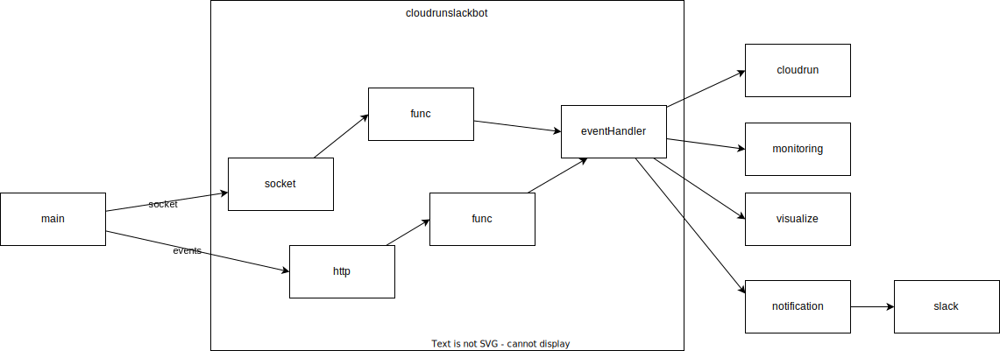
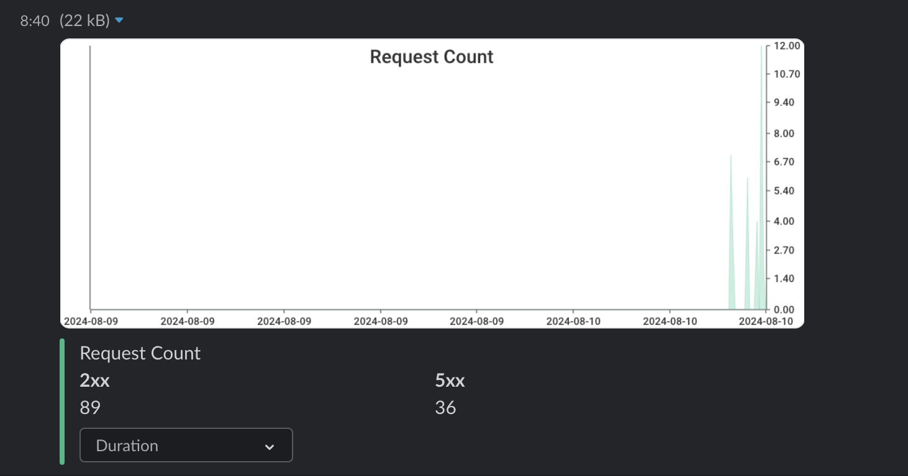

# Implementation

## Features

The Cloud Run Slack Bot provides an interface to interact with Cloud Run services and jobs through a Slack bot.

### Cloud Run Services

The bot can:
- List all Cloud Run services in the configured project and region
- Describe a specific Cloud Run service (image, latest revision, resource limits, etc.)
- Show metrics for a Cloud Run service (request count, latency)

### Cloud Run Jobs

The bot can:
- List all Cloud Run jobs in the configured project and region
- Describe a specific Cloud Run job (image, update time, resource limits, etc.)

## Commands

- `describe` or `d`: Describe the currently selected Cloud Run service or job
- `metrics` or `m`: Show metrics for the currently selected Cloud Run service
- `set` or `s`: Set the current Cloud Run service or job
- `help` or `h`: Show help information

## Architecture



The bot uses:
- Google Cloud Run API to interact with Cloud Run services and jobs
- Google Cloud Monitoring API to fetch metrics
- Slack API to interact with Slack

## `UploadFileV2Context` with `Channel`

If `UploadFileV2Context` is used without `Channel`, it's possible to upload file without sending a message.

But we can't use `URLPrivate` if you don't upload file with `Channel`. (ref: https://github.com/nakamasato/cloud-run-slack-bot/pull/56)


You can check: https://app.slack.com/block-kit-builder

```json
{
	"blocks": [
		{
			"type": "image",
			"slack_file": {
				"url": "https://files.slack.com/files-pri/TK8MCGJHH-F07GD216W4S/cloud-run-slack-bot-metrics.png"
			},
			"alt_text": "inspiration"
		}
	]
}
```


